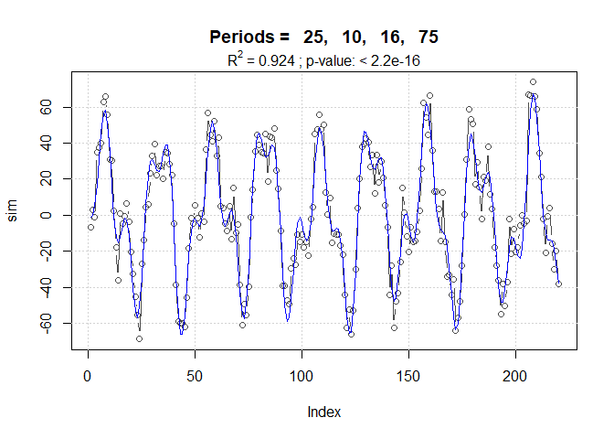

periods: Extracción y modelación de periodicidades en series de tiempo
regulares
================

## Instalación

El paquete **periods** es la implementación en R del método presentado
en González-Rodríguez et al. (2015). Se puede instalar desde github con
ayuda de **devtools**, el cual a su vez se instala de la manera habitual
en caso de no estar ya disponible.

``` r
install.packages("devtools") # si no está ya instalado

library(devtools)
install_github("hvillalo/periods")
```

## Ejemplo de uso

### Serie simulada

Se generó una serie de tiempo (n = 220) con cuatro componentes
harmónicos definidos por los parámetros siguientes: periodos = 25, 10,
16 y 73; amplitudes 40, 20, 10 y 5; fases = 2, 5, 1 y 0; media = 0; sin
tendencia lineal y 10 % de ruido aleatorio.

``` r
library(periods)

## Serie simulada ----
data(sim)

# Plot
plot(sim, type = "l")
```


**Busqueda de periodicidades con descenso cíclico**

La función `cyclicDescent()` se encarga de manera automática de esto.
Basta indicar el vector de la serie de tiempo.

``` r
sim.cd <- cyclicDescent(x=sim)
```

El resultado es una lista con dos elementos, los harmónicos y las
pruebas de significancia

``` r
# componentes harmónicos
sim.cd$harmonics
```

              Period Amplitude      Phase       Lag      RSS      R.sq
    Model 1 :     25 40.290188  2.0200464  8.037509 76155.61 0.6998248
    Model 2 :     10 20.049342 -1.2151491 -1.933970 31938.24 0.8741121
    Model 3 :     16  9.856530  1.0029183  2.553910 21124.79 0.9167345
    Model 4 :     75  3.985973 -0.1135317 -1.355185 19415.50 0.9234718
    Model 5 :      5  2.170549  1.9933169  1.586231 18897.26 0.9255145

``` r
# Estadísticos
sim.cd$Stats
```

                            F dfn dfd   p.value
    Models 1 & 2 : 148.829972   2 215 < 2.2e-16
    Models 2 & 3 :  54.515691   2 213 < 2.2e-16
    Models 3 & 4 :   9.287941   2 211 0.0001362
    Models 4 & 5 :   2.865822   2 209 0.0591766

Como puede verse en la comparación del valor de R<sup>2</sup> entre los
modelos 4 y 5, p \> 0.05, por lo que el último componente harmónico
(periodo = 5; amplitud = 2.17 ; fase = 1.99) ya no es significativo.

### Ajuste del modelo final por regresión lineal múltiple

Una vez encontrados lo periodos significativos, se procede al ajuste del
modelo final, donde se hace la estimación de los parámetros
a<sub>1</sub> y b<sub>1</sub> de cada harmónico al mismo tiempo.

``` r
op <- sim.cd$harmonics$Period[1:4] # solo los primeros 4 periodos 
sim.fit <- lm.harmonics(x = sim, periods = op, trend = FALSE)
sim.fit
```


    Call:
    lm(formula = modl, data = datdf)

    Coefficients:
    cos(2 * pi/25 * t)  sin(2 * pi/25 * t)  cos(2 * pi/10 * t)  sin(2 * pi/10 * t)  
              -17.1753             36.5393              7.0845            -19.1224  
    cos(2 * pi/16 * t)  sin(2 * pi/16 * t)  cos(2 * pi/75 * t)  sin(2 * pi/75 * t)  
                5.4185              8.2432              3.9721             -0.4508  

`sim.fit` es un objeto de clase `lm`, que preferimos mantener para
aprovechar toda la maquinaria desarrollada en R para los modelos
lineales. Por ejemplo, podemos revisar la tabla de regresión resultante

``` r
summary(sim.fit)
```


    Call:
    lm(formula = modl, data = datdf)

    Residuals:
        Min      1Q  Median      3Q     Max 
    -22.210  -7.348  -1.155   5.491  26.427 

    Coefficients:
                       Estimate Std. Error t value Pr(>|t|)    
    cos(2 * pi/25 * t) -17.1753     0.9170 -18.729  < 2e-16 ***
    sin(2 * pi/25 * t)  36.5393     0.9080  40.242  < 2e-16 ***
    cos(2 * pi/10 * t)   7.0845     0.9120   7.768 3.37e-13 ***
    sin(2 * pi/10 * t) -19.1224     0.9124 -20.959  < 2e-16 ***
    cos(2 * pi/16 * t)   5.4185     0.9147   5.924 1.26e-08 ***
    sin(2 * pi/16 * t)   8.2432     0.9103   9.055  < 2e-16 ***
    cos(2 * pi/75 * t)   3.9721     0.9227   4.305 2.55e-05 ***
    sin(2 * pi/75 * t)  -0.4508     0.9024  -0.500    0.618    
    ---
    Signif. codes:  0 '***' 0.001 '**' 0.01 '*' 0.05 '.' 0.1 ' ' 1

    Residual standard error: 9.562 on 212 degrees of freedom
    Multiple R-squared:  0.9236,    Adjusted R-squared:  0.9207 
    F-statistic: 320.4 on 8 and 212 DF,  p-value: < 2.2e-16

A partir de a<sub>1</sub> y b<sub>1</sub> podemos calcular las
amplitudes y fases correspondientes a través de la función
`makeHarmonics()`

``` r
# generar harmónicos
harmonics <- makeHarmonics(sim.fit)
harmonics
```

    $cyclic_components
      Period Amplitude      Phase       Lag
    1     25 40.374632  2.0101986  7.998326
    2     10 20.392552 -1.2159934 -1.935314
    3     16  9.864595  0.9892816  2.519185
    4     75  3.997617 -0.1129975 -1.348808

La figura del modelo final se puede obtener así:

``` r
# Plot final
R2 <- as.numeric(formatC(summary(sim.fit)$r.squared, digits=3))
stat <- summary(sim.fit)$fstatistic
pval <- pf(stat[1], stat[2], stat[3], lower.tail = FALSE)
pval <- format.pval(pval, digits = max(3, getOption("digits") - 3))

main.t <- paste("Periods =", paste(formatC(op, digits=3), collapse=", "))
sub.t <- substitute(paste(R^2, " = ", R2, " ; ", "p-value: ", pval), 
                    list( R2 = R2, pval = pval ))

par(mfrow = c(1, 1))
plot(sim, type = "b", col = "grey50", main = main.t)
grid()
lines(fitted(sim.fit), col = "blue")
mtext(sub.t, side = 3)
```


