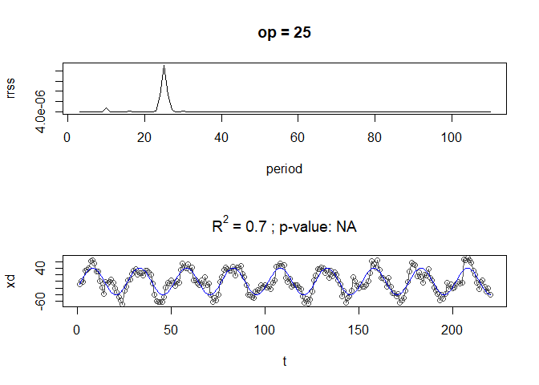
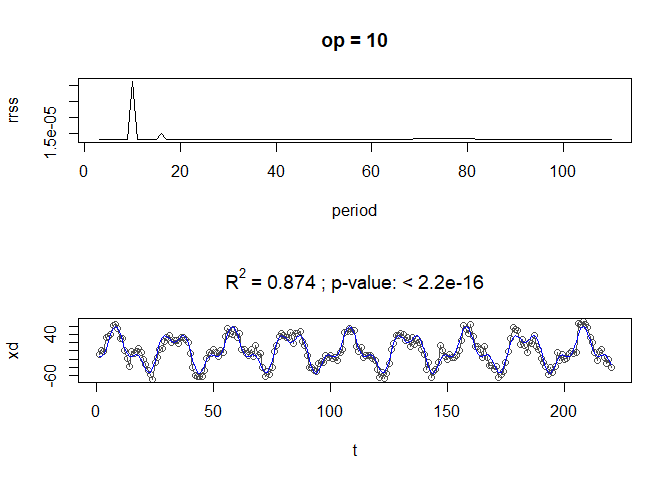
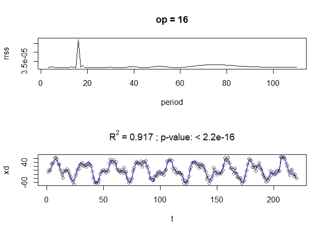
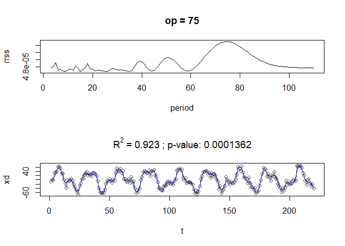
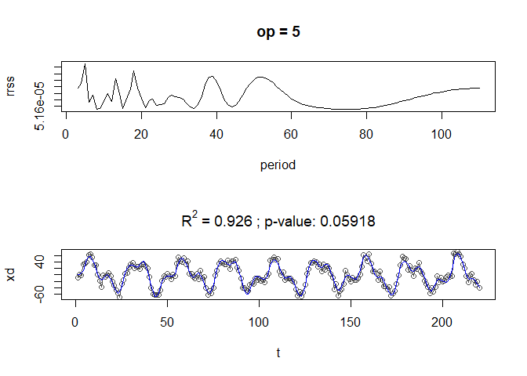
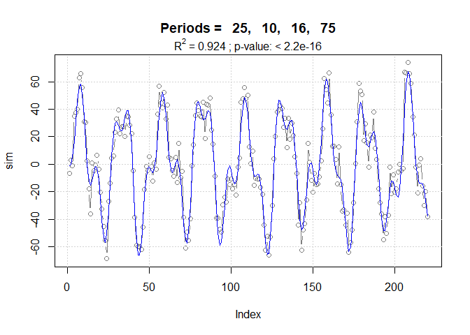

periods: Extracción y modelación de periodicidades en series de tiempo
regulares
================

- <a href="#periods" id="toc-periods">periods</a>
- <a href="#instalación" id="toc-instalación">Instalación</a>

## periods

El paquete **periods** es la implementación en R del método presentado
en González-Rodríguez et al. (2015).

## Instalación

Este paquete reside en [github](https://github.com/hvillalo/periods) y
se puede instalar con ayuda de devtools, el cual si no está instalado se
puede instalar de la manera normal.

``` r
install.packages("devtools") # si no está ya instalado

library(devtools)
install_github("hvillalo/periods")
```

Primera prueba

``` r
library(periods)


## Serie simulada ----
data(sim)

# Plot
plot(sim, type = "l")
```


``` r
# Descenso cíclico
sim.cd <- cyclicDescent(x=sim, plots = "a", rrss = TRUE)
```











``` r
sim.cd
```

    $RRSS
    $RRSS[[1]]
        period         rrss
    1        3 3.945911e-06
    2        4 3.945617e-06
    3        5 3.952276e-06
    4        6 3.941878e-06
    5        7 3.945496e-06
    6        8 3.943631e-06
    7        9 3.948508e-06
    8       10 4.725526e-06
    9       11 3.944995e-06
    10      12 3.961077e-06
    11      13 3.951809e-06
    12      14 3.951151e-06
    13      15 3.947517e-06
    14      16 4.096989e-06
    15      17 3.947490e-06
    16      18 3.943381e-06
    17      19 3.974907e-06
    18      20 3.965117e-06
    19      21 4.004203e-06
    20      22 3.991695e-06
    21      23 4.212527e-06
    22      24 7.159549e-06
    23      25 1.313101e-05
    24      26 7.264677e-06
    25      27 4.478161e-06
    26      28 3.947149e-06
    27      29 4.035165e-06
    28      30 4.088955e-06
    29      31 4.006956e-06
    30      32 3.944885e-06
    31      33 3.954630e-06
    32      34 3.984134e-06
    33      35 3.986245e-06
    34      36 3.963993e-06
    35      37 3.944813e-06
    36      38 3.945652e-06
    37      39 3.962739e-06
    38      40 3.981127e-06
    39      41 3.988874e-06
    40      42 3.983352e-06
    41      43 3.969281e-06
    42      44 3.954077e-06
    43      45 3.944028e-06
    44      46 3.942239e-06
    45      47 3.948152e-06
    46      48 3.958534e-06
    47      49 3.969388e-06
    48      50 3.977598e-06
    49      51 3.981585e-06
    50      52 3.981159e-06
    51      53 3.977052e-06
    52      54 3.970467e-06
    53      55 3.962767e-06
    54      56 3.955295e-06
    55      57 3.949226e-06
    56      58 3.945429e-06
    57      59 3.944352e-06
    58      60 3.945984e-06
    59      61 3.949917e-06
    60      62 3.955501e-06
    61      63 3.962008e-06
    62      64 3.968766e-06
    63      65 3.975238e-06
    64      66 3.981047e-06
    65      67 3.985965e-06
    66      68 3.989882e-06
    67      69 3.992771e-06
    68      70 3.994657e-06
    69      71 3.995588e-06
    70      72 3.995626e-06
    71      73 3.994839e-06
    72      74 3.993306e-06
    73      75 3.991116e-06
    74      76 3.988376e-06
    75      77 3.985207e-06
    76      78 3.981743e-06
    77      79 3.978122e-06
    78      80 3.974483e-06
    79      81 3.970948e-06
    80      82 3.967625e-06
    81      83 3.964593e-06
    82      84 3.961906e-06
    83      85 3.959593e-06
    84      86 3.957657e-06
    85      87 3.956085e-06
    86      88 3.954848e-06
    87      89 3.953909e-06
    88      90 3.953224e-06
    89      91 3.952749e-06
    90      92 3.952440e-06
    91      93 3.952257e-06
    92      94 3.952165e-06
    93      95 3.952133e-06
    94      96 3.952135e-06
    95      97 3.952151e-06
    96      98 3.952166e-06
    97      99 3.952168e-06
    98     100 3.952150e-06
    99     101 3.952108e-06
    100    102 3.952039e-06
    101    103 3.951941e-06
    102    104 3.951816e-06
    103    105 3.951664e-06
    104    106 3.951486e-06
    105    107 3.951284e-06
    106    108 3.951060e-06
    107    109 3.950814e-06
    108    110 3.950549e-06

    $RRSS[[2]]
        period         rrss
    1        3 1.317337e-05
    2        4 1.317871e-05
    3        5 1.323102e-05
    4        6 1.314153e-05
    5        7 1.314573e-05
    6        8 1.314810e-05
    7        9 1.321240e-05
    8       10 3.131043e-05
    9       11 1.315368e-05
    10      12 1.322000e-05
    11      13 1.320353e-05
    12      14 1.324192e-05
    13      15 1.317093e-05
    14      16 1.497769e-05
    15      17 1.318775e-05
    16      18 1.331233e-05
    17      19 1.316385e-05
    18      20 1.313397e-05
    19      21 1.314018e-05
    20      22 1.314750e-05
    21      23 1.314226e-05
    22      24 1.313433e-05
    23      26 1.313510e-05
    24      27 1.314498e-05
    25      28 1.315171e-05
    26      29 1.314997e-05
    27      30 1.314817e-05
    28      31 1.315083e-05
    29      32 1.315297e-05
    30      33 1.314655e-05
    31      34 1.313522e-05
    32      35 1.313340e-05
    33      36 1.315032e-05
    34      37 1.318375e-05
    35      38 1.321959e-05
    36      39 1.323888e-05
    37      40 1.323279e-05
    38      41 1.320759e-05
    39      42 1.317627e-05
    40      43 1.315073e-05
    41      44 1.313943e-05
    42      45 1.314658e-05
    43      46 1.317081e-05
    44      47 1.320511e-05
    45      48 1.323971e-05
    46      49 1.326626e-05
    47      50 1.328019e-05
    48      51 1.328066e-05
    49      52 1.326924e-05
    50      53 1.324880e-05
    51      54 1.322279e-05
    52      55 1.319497e-05
    53      56 1.316911e-05
    54      57 1.314868e-05
    55      58 1.313636e-05
    56      59 1.313361e-05
    57      60 1.314053e-05
    58      61 1.315603e-05
    59      62 1.317823e-05
    60      63 1.320502e-05
    61      64 1.323436e-05
    62      65 1.326454e-05
    63      66 1.329421e-05
    64      67 1.332238e-05
    65      68 1.334830e-05
    66      69 1.337142e-05
    67      70 1.339131e-05
    68      71 1.340762e-05
    69      72 1.342009e-05
    70      73 1.342851e-05
    71      74 1.343278e-05
    72      75 1.343290e-05
    73      76 1.342901e-05
    74      77 1.342136e-05
    75      78 1.341036e-05
    76      79 1.339655e-05
    77      80 1.338054e-05
    78      81 1.336298e-05
    79      82 1.334453e-05
    80      83 1.332578e-05
    81      84 1.330729e-05
    82      85 1.328948e-05
    83      86 1.327269e-05
    84      87 1.325717e-05
    85      88 1.324304e-05
    86      89 1.323040e-05
    87      90 1.321924e-05
    88      91 1.320953e-05
    89      92 1.320119e-05
    90      93 1.319414e-05
    91      94 1.318826e-05
    92      95 1.318343e-05
    93      96 1.317956e-05
    94      97 1.317651e-05
    95      98 1.317418e-05
    96      99 1.317248e-05
    97     100 1.317131e-05
    98     101 1.317058e-05
    99     102 1.317022e-05
    100    103 1.317017e-05
    101    104 1.317037e-05
    102    105 1.317077e-05
    103    106 1.317133e-05
    104    107 1.317200e-05
    105    108 1.317276e-05
    106    109 1.317358e-05
    107    110 1.317444e-05

    $RRSS[[3]]
        period         rrss
    1        3 3.156460e-05
    2        4 3.158303e-05
    3        5 3.188514e-05
    4        6 3.139871e-05
    5        7 3.148090e-05
    6        8 3.131201e-05
    7        9 3.132830e-05
    8       11 3.143964e-05
    9       12 3.138337e-05
    10      13 3.182610e-05
    11      14 3.156173e-05
    12      15 3.134838e-05
    13      16 4.733775e-05
    14      17 3.159082e-05
    15      18 3.270121e-05
    16      19 3.137896e-05
    17      20 3.132730e-05
    18      21 3.147159e-05
    19      22 3.140436e-05
    20      23 3.142454e-05
    21      24 3.134219e-05
    22      26 3.136356e-05
    23      27 3.137257e-05
    24      28 3.148181e-05
    25      29 3.158875e-05
    26      30 3.156384e-05
    27      31 3.146207e-05
    28      32 3.141384e-05
    29      33 3.140638e-05
    30      34 3.138995e-05
    31      35 3.138565e-05
    32      36 3.144653e-05
    33      37 3.160262e-05
    34      38 3.180268e-05
    35      39 3.193523e-05
    36      40 3.192966e-05
    37      41 3.180285e-05
    38      42 3.162018e-05
    39      43 3.145267e-05
    40      44 3.135836e-05
    41      45 3.137036e-05
    42      46 3.148635e-05
    43      47 3.166868e-05
    44      48 3.186146e-05
    45      49 3.201503e-05
    46      50 3.210107e-05
    47      51 3.211301e-05
    48      52 3.205905e-05
    49      53 3.195508e-05
    50      54 3.182058e-05
    51      55 3.167654e-05
    52      56 3.154396e-05
    53      57 3.144187e-05
    54      58 3.138468e-05
    55      59 3.138005e-05
    56      60 3.142811e-05
    57      61 3.152247e-05
    58      62 3.165264e-05
    59      63 3.180666e-05
    60      64 3.197320e-05
    61      65 3.214281e-05
    62      66 3.230827e-05
    63      67 3.246440e-05
    64      68 3.260760e-05
    65      69 3.273531e-05
    66      70 3.284561e-05
    67      71 3.293685e-05
    68      72 3.300763e-05
    69      73 3.305674e-05
    70      74 3.308339e-05
    71      75 3.308735e-05
    72      76 3.306915e-05
    73      77 3.303014e-05
    74      78 3.297257e-05
    75      79 3.289938e-05
    76      80 3.281406e-05
    77      81 3.272035e-05
    78      82 3.262195e-05
    79      83 3.252226e-05
    80      84 3.242419e-05
    81      85 3.233010e-05
    82      86 3.224168e-05
    83      87 3.216008e-05
    84      88 3.208590e-05
    85      89 3.201931e-05
    86      90 3.196015e-05
    87      91 3.190804e-05
    88      92 3.186241e-05
    89      93 3.182262e-05
    90      94 3.178801e-05
    91      95 3.175791e-05
    92      96 3.173168e-05
    93      97 3.170875e-05
    94      98 3.168861e-05
    95      99 3.167082e-05
    96     100 3.165500e-05
    97     101 3.164085e-05
    98     102 3.162810e-05
    99     103 3.161655e-05
    100    104 3.160603e-05
    101    105 3.159641e-05
    102    106 3.158758e-05
    103    107 3.157944e-05
    104    108 3.157192e-05
    105    109 3.156496e-05
    106    110 3.155849e-05

    $RRSS[[4]]
        period         rrss
    1        3 4.788671e-05
    2        4 4.800325e-05
    3        5 4.852920e-05
    4        6 4.755044e-05
    5        7 4.767574e-05
    6        8 4.734010e-05
    7        9 4.735278e-05
    8       11 4.773701e-05
    9       12 4.749058e-05
    10      13 4.816695e-05
    11      14 4.786726e-05
    12      15 4.737810e-05
    13      17 4.787941e-05
    14      18 4.848310e-05
    15      19 4.780018e-05
    16      20 4.762701e-05
    17      21 4.745080e-05
    18      22 4.757358e-05
    19      23 4.748901e-05
    20      24 4.740195e-05
    21      26 4.738593e-05
    22      27 4.756750e-05
    23      28 4.775152e-05
    24      29 4.772003e-05
    25      30 4.759164e-05
    26      31 4.754321e-05
    27      32 4.757328e-05
    28      33 4.753198e-05
    29      34 4.741147e-05
    30      35 4.738022e-05
    31      36 4.757523e-05
    32      37 4.799920e-05
    33      38 4.848139e-05
    34      39 4.875908e-05
    35      40 4.869489e-05
    36      41 4.836381e-05
    37      42 4.793921e-05
    38      43 4.758238e-05
    39      44 4.740879e-05
    40      45 4.747770e-05
    41      46 4.777674e-05
    42      47 4.822020e-05
    43      48 4.868216e-05
    44      49 4.904886e-05
    45      50 4.925367e-05
    46      51 4.928003e-05
    47      52 4.914643e-05
    48      53 4.889063e-05
    49      54 4.855964e-05
    50      55 4.820430e-05
    51      56 4.787491e-05
    52      57 4.761624e-05
    53      58 4.746184e-05
    54      59 4.742965e-05
    55      60 4.752075e-05
    56      61 4.772197e-05
    57      62 4.801093e-05
    58      63 4.836171e-05
    59      64 4.874921e-05
    60      65 4.915171e-05
    61      66 4.955167e-05
    62      67 4.993547e-05
    63      68 5.029260e-05
    64      69 5.061476e-05
    65      70 5.089512e-05
    66      71 5.112792e-05
    67      72 5.130834e-05
    68      73 5.143262e-05
    69      74 5.149843e-05
    70      75 5.150524e-05
    71      76 5.145468e-05
    72      77 5.135070e-05
    73      78 5.119944e-05
    74      79 5.100888e-05
    75      80 5.078822e-05
    76      81 5.054717e-05
    77      82 5.029516e-05
    78      83 5.004081e-05
    79      84 4.979143e-05
    80      85 4.955281e-05
    81      86 4.932921e-05
    82      87 4.912342e-05
    83      88 4.893698e-05
    84      89 4.877040e-05
    85      90 4.862338e-05
    86      91 4.849507e-05
    87      92 4.838424e-05
    88      93 4.828940e-05
    89      94 4.820897e-05
    90      95 4.814135e-05
    91      96 4.808498e-05
    92      97 4.803837e-05
    93      98 4.800017e-05
    94      99 4.796916e-05
    95     100 4.794423e-05
    96     101 4.792441e-05
    97     102 4.790889e-05
    98     103 4.789693e-05
    99     104 4.788792e-05
    100    105 4.788134e-05
    101    106 4.787674e-05
    102    107 4.787374e-05
    103    108 4.787202e-05
    104    109 4.787130e-05
    105    110 4.787136e-05

    $RRSS[[5]]
        period         rrss
    1        3 5.215454e-05
    2        4 5.229472e-05
    3        5 5.291772e-05
    4        6 5.173609e-05
    5        7 5.194522e-05
    6        8 5.151562e-05
    7        9 5.153689e-05
    8       11 5.198130e-05
    9       12 5.174400e-05
    10      13 5.245750e-05
    11      14 5.209796e-05
    12      15 5.153219e-05
    13      17 5.212716e-05
    14      18 5.269695e-05
    15      19 5.216552e-05
    16      20 5.184792e-05
    17      21 5.156225e-05
    18      22 5.177495e-05
    19      23 5.183261e-05
    20      24 5.163047e-05
    21      26 5.168121e-05
    22      27 5.186567e-05
    23      28 5.193705e-05
    24      29 5.190362e-05
    25      30 5.187226e-05
    26      31 5.181886e-05
    27      32 5.171584e-05
    28      33 5.158019e-05
    29      34 5.153055e-05
    30      35 5.165397e-05
    31      36 5.192773e-05
    32      37 5.225505e-05
    33      38 5.248974e-05
    34      39 5.251743e-05
    35      40 5.234907e-05
    36      41 5.208785e-05
    37      42 5.183584e-05
    38      43 5.165700e-05
    39      44 5.158403e-05
    40      45 5.162517e-05
    41      46 5.176233e-05
    42      47 5.195415e-05
    43      48 5.215159e-05
    44      49 5.231650e-05
    45      50 5.242993e-05
    46      51 5.248876e-05
    47      52 5.249852e-05
    48      53 5.246775e-05
    49      54 5.240540e-05
    50      55 5.232018e-05
    51      56 5.222064e-05
    52      57 5.211518e-05
    53      58 5.201159e-05
    54      59 5.191628e-05
    55      60 5.183351e-05
    56      61 5.176506e-05
    57      62 5.171055e-05
    58      63 5.166812e-05
    59      64 5.163527e-05
    60      65 5.160950e-05
    61      66 5.158869e-05
    62      67 5.157133e-05
    63      68 5.155644e-05
    64      69 5.154350e-05
    65      70 5.153233e-05
    66      71 5.152293e-05
    67      72 5.151538e-05
    68      73 5.150983e-05
    69      74 5.150641e-05
    70      76 5.150644e-05
    71      77 5.151012e-05
    72      78 5.151634e-05
    73      79 5.152516e-05
    74      80 5.153658e-05
    75      81 5.155059e-05
    76      82 5.156711e-05
    77      83 5.158605e-05
    78      84 5.160727e-05
    79      85 5.163059e-05
    80      86 5.165582e-05
    81      87 5.168273e-05
    82      88 5.171108e-05
    83      89 5.174057e-05
    84      90 5.177093e-05
    85      91 5.180182e-05
    86      92 5.183291e-05
    87      93 5.186388e-05
    88      94 5.189436e-05
    89      95 5.192405e-05
    90      96 5.195262e-05
    91      97 5.197979e-05
    92      98 5.200533e-05
    93      99 5.202904e-05
    94     100 5.205077e-05
    95     101 5.207043e-05
    96     102 5.208795e-05
    97     103 5.210336e-05
    98     104 5.211667e-05
    99     105 5.212796e-05
    100    106 5.213734e-05
    101    107 5.214493e-05
    102    108 5.215087e-05
    103    109 5.215531e-05
    104    110 5.215841e-05


    $harmonics
              Period Amplitude      Phase       Lag      RSS      R.sq
    Model 1 :     25 40.290188  2.0200464  8.037509 76155.61 0.6998248
    Model 2 :     10 20.049342 -1.2151491 -1.933970 31938.24 0.8741121
    Model 3 :     16  9.856530  1.0029183  2.553910 21124.79 0.9167345
    Model 4 :     75  3.985973 -0.1135317 -1.355185 19415.50 0.9234718
    Model 5 :      5  2.170549  1.9933169  1.586231 18897.26 0.9255145

    $Stats
                            F dfn dfd   p.value
    Models 1 & 2 : 148.829972   2 215 < 2.2e-16
    Models 2 & 3 :  54.515691   2 213 < 2.2e-16
    Models 3 & 4 :   9.287941   2 211 0.0001362
    Models 4 & 5 :   2.865822   2 209 0.0591766

    attr(,"class")
    [1] "periods"

``` r
# componentes harmónicos
sim.cd$harmonics
```

              Period Amplitude      Phase       Lag      RSS      R.sq
    Model 1 :     25 40.290188  2.0200464  8.037509 76155.61 0.6998248
    Model 2 :     10 20.049342 -1.2151491 -1.933970 31938.24 0.8741121
    Model 3 :     16  9.856530  1.0029183  2.553910 21124.79 0.9167345
    Model 4 :     75  3.985973 -0.1135317 -1.355185 19415.50 0.9234718
    Model 5 :      5  2.170549  1.9933169  1.586231 18897.26 0.9255145

``` r
 # Estadísticos
sim.cd$Stats
```

                            F dfn dfd   p.value
    Models 1 & 2 : 148.829972   2 215 < 2.2e-16
    Models 2 & 3 :  54.515691   2 213 < 2.2e-16
    Models 3 & 4 :   9.287941   2 211 0.0001362
    Models 4 & 5 :   2.865822   2 209 0.0591766

``` r
# Ajuste final
op <- sim.cd$harmonics$Period[1:4] # solo los primeros 4 periodos son significativos
sim.fit <- lm.harmonics(x = sim, periods = op, trend = FALSE)
summary(sim.fit)
```


    Call:
    lm(formula = modl, data = datdf)

    Residuals:
        Min      1Q  Median      3Q     Max 
    -22.210  -7.348  -1.155   5.491  26.427 

    Coefficients:
                       Estimate Std. Error t value Pr(>|t|)    
    cos(2 * pi/25 * t) -17.1753     0.9170 -18.729  < 2e-16 ***
    sin(2 * pi/25 * t)  36.5393     0.9080  40.242  < 2e-16 ***
    cos(2 * pi/10 * t)   7.0845     0.9120   7.768 3.37e-13 ***
    sin(2 * pi/10 * t) -19.1224     0.9124 -20.959  < 2e-16 ***
    cos(2 * pi/16 * t)   5.4185     0.9147   5.924 1.26e-08 ***
    sin(2 * pi/16 * t)   8.2432     0.9103   9.055  < 2e-16 ***
    cos(2 * pi/75 * t)   3.9721     0.9227   4.305 2.55e-05 ***
    sin(2 * pi/75 * t)  -0.4508     0.9024  -0.500    0.618    
    ---
    Signif. codes:  0 '***' 0.001 '**' 0.01 '*' 0.05 '.' 0.1 ' ' 1

    Residual standard error: 9.562 on 212 degrees of freedom
    Multiple R-squared:  0.9236,    Adjusted R-squared:  0.9207 
    F-statistic: 320.4 on 8 and 212 DF,  p-value: < 2.2e-16

``` r
# generar harmónicos
(harmonics <- makeHarmonics(sim.fit))
```

    $cyclic_components
      Period Amplitude      Phase       Lag
    1     25 40.374632  2.0101986  7.998326
    2     10 20.392552 -1.2159934 -1.935314
    3     16  9.864595  0.9892816  2.519185
    4     75  3.997617 -0.1129975 -1.348808

``` r
# Plot final
R2 <- as.numeric(formatC(summary(sim.fit)$r.squared, digits=3))
stat <- summary(sim.fit)$fstatistic
pval <- pf(stat[1], stat[2], stat[3], lower.tail = FALSE)
pval <- format.pval(pval, digits = max(3, getOption("digits") - 3))

main.t <- paste("Periods =", paste(formatC(op, digits=3), collapse=", "))
sub.t <- substitute(paste(R^2, " = ", R2, " ; ", "p-value: ", pval), 
                    list( R2 = R2, pval = pval ))

par(mfrow = c(1, 1))
plot(sim, type = "b", col = "grey50", main = main.t)
grid()
lines(fitted(sim.fit), col = "blue")
mtext(sub.t, side = 3)
```


