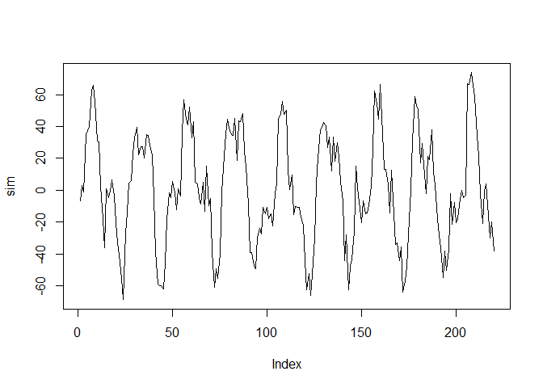
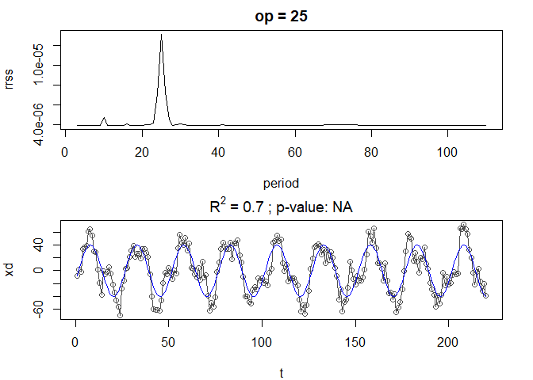
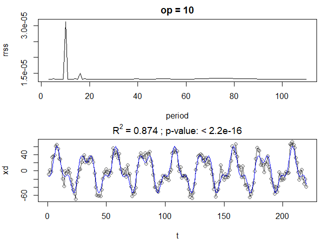
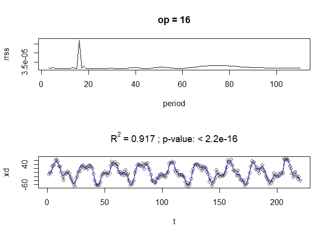
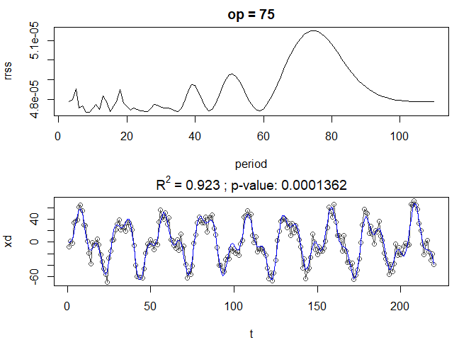
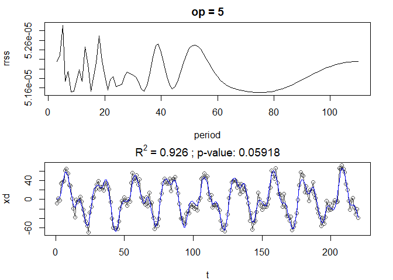
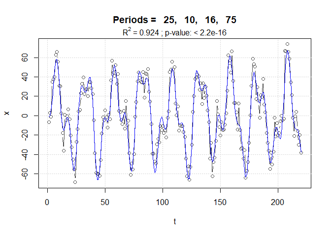

Extracción y modelación de periodicidades en series de tiempo regulares.
El paquete ‘periods’.
================

## Instalación

El paquete **periods** es la implementación en R del método presentado
en González-Rodríguez et al. (2015) (ver
<http://dx.doi.org/10.4236/ojs.2015.56062>). Se puede instalar desde
github con ayuda de **devtools**, el cual a su vez se instala de la
manera habitual en caso de no estar ya disponible.

``` r
install.packages("devtools") # si no está instalado

library(devtools)
install_github("hvillalo/periods") # instalación de 'periods' desde github
```

## Ejemplo de uso

### Serie simulada

El paquete incluye una serie de tiempo simulada (n = 220) con las
siguientes características: media = 0, sin tendencia lineal y cuatro
componentes armónicos definidos por los parámetros: periodos = 25, 10,
16, 73; amplitudes = 40, 20, 10, 5; y fases = 2, 5, 1, 0.
Adicionalmente, la serie contiene un 10 % de ruido aleatorio.

Una vez que el paquete ha sido activado, la serie simulada se puede
cargar en memoria con la función `data()`.

``` r
library(periods)

# Serie simulada
data(sim)

# gráfica 
plot(sim, type = "l")
```



**Búsqueda de periodicidades con descenso cíclico**

El primer paso del análisis consiste en buscar los periodos dominantes
en la serie de tiempo. De esto se encarga la función `cyclicDescent()`,
a la que le basta con que se especifique el vector de la serie de tiempo
a procesar.

``` r
sim.cd <- cyclicDescent(x = sim)
```

El resultado es una lista con los componentes armónicos encontrados y
las pruebas de significancia estadística del aumento de R<sup>2</sup>
entre modelos sucesivos.

``` r
# componentes armónicos
sim.cd$harmonics
```

              Period Amplitude      Phase       Lag      RSS      R.sq
    Model 1 :     25 40.290188  2.0200464  8.037509 76155.61 0.6998248
    Model 2 :     10 20.049342 -1.2151491 -1.933970 31938.24 0.8741121
    Model 3 :     16  9.856530  1.0029183  2.553910 21124.79 0.9167345
    Model 4 :     75  3.985973 -0.1135317 -1.355185 19415.50 0.9234718
    Model 5 :      5  2.170549  1.9933169  1.586231 18897.26 0.9255145

``` r
# estadísticos
sim.cd$Stats
```

                            F dfn dfd   p.value
    Models 1 & 2 : 148.829972   2 215 < 2.2e-16
    Models 2 & 3 :  54.515691   2 213 < 2.2e-16
    Models 3 & 4 :   9.287941   2 211 0.0001362
    Models 4 & 5 :   2.865822   2 209 0.0591766

Como puede verse, el aumento en R<sup>2</sup> al pasar del Modelo 4 (con
cuatro componentes armónicos) al Modelo 5, no es significativo, por lo
que este último se descarta.

La función `cyclicDescent()` tiene muchos argumentos más, cuyo uso se
puede consultar en la publicación mencionada o preferentemente en la
ayuda del paquete (`?cyclicDescent`), ya que **existen algunas
diferencias entre las implementaciones en Matlab y en R**.

Un ejemplo de un argumento interesante es `plots = TRUE`, el cual
produce los gráficos de cada modelo. Cabe mencionar que aparte del
primer modelo que solo tiene un componente armónico, los subsiguientes
corresponden a la suma de los componentes sucesivos. En el caso
anterior, por ejemplo, el modelo 3 incluye los periodos 25, 10, 16 y sus
correspondientes amplitudes y fases.

``` r
cyclicDescent(sim, plots = TRUE)
```











    $harmonics
              Period Amplitude      Phase       Lag      RSS      R.sq
    Model 1 :     25 40.290188  2.0200464  8.037509 76155.61 0.6998248
    Model 2 :     10 20.049342 -1.2151491 -1.933970 31938.24 0.8741121
    Model 3 :     16  9.856530  1.0029183  2.553910 21124.79 0.9167345
    Model 4 :     75  3.985973 -0.1135317 -1.355185 19415.50 0.9234718
    Model 5 :      5  2.170549  1.9933169  1.586231 18897.26 0.9255145

    $Stats
                            F dfn dfd   p.value
    Models 1 & 2 : 148.829972   2 215 < 2.2e-16
    Models 2 & 3 :  54.515691   2 213 < 2.2e-16
    Models 3 & 4 :   9.287941   2 211 0.0001362
    Models 4 & 5 :   2.865822   2 209 0.0591766

    attr(,"class")
    [1] "periods"

### Ajuste del modelo final por regresión lineal múltiple

Una vez encontrados los periodos significativos, se procede al ajuste
del modelo final, donde se hace la estimación de los parámetros $a_i$ y
$b_i$ de cada armónico, y en su caso de la tendencia lineal
($\alpha + \beta t$):

$$ X_e = \alpha + \beta t + \sum_{i=1}^m \bigg(a_i \cdot cos(2\pi p_i^{-1}t) + b_i \cdot sin(2\pi p_i^{-1}t) \bigg) $$

Este modelo corresponde a la llamada regresión periódica y se ajusta por
regresión lineal múltiple con la función `lm()`, que requiere que se le
pase la fórmula a ajustar de manera explícita, por ejemplo, para dos
armónicos y con tendencia lineal:

``` r
lm(x ~ t + cos(2*pi/25*t) + sin(2*pi/25*t) + cos(2*pi/10*t) + sin(2*pi/10*t))
```

Aunque la construcción de la fórmula del modelo no es difícil, la
función `lm.harmonics()` lo hace de manera automática.

``` r
op <- sim.cd$harmonics$Period[1:4] # solo interesan los primeros 4 periodos 
lm.harmonics(x = sim, periods = op, trend = TRUE)
```


    Call:
    lm(formula = modl, data = datdf)

    Coefficients:
           (Intercept)                   t  cos(2 * pi/25 * t)  sin(2 * pi/25 * t)  
             -0.427925           -0.001638          -17.205192           36.543602  
    cos(2 * pi/10 * t)  sin(2 * pi/10 * t)  cos(2 * pi/16 * t)  sin(2 * pi/16 * t)  
              7.086595          -19.126601            5.397019            8.250565  
    cos(2 * pi/75 * t)  sin(2 * pi/75 * t)  
              3.936108           -0.483488  

En lugar de la función `lm.harmonics` se recomienda usar la función
`periodicRegModel()`, que es más transparente sobre lo que se está
haciendo, que es construir la fórmula del modelo y preparar la tabla de
datos para el ajuste, lo que puede incluir generar el vector de tiempo
si es que no se proporcionó y centrar la serie de tiempo a media cero.

``` r
perReg <- periodicRegModel(x = sim, periods = op, center.x = FALSE)
# este es el modelo que será ajustado
perReg$model
```

    x ~ 0 + cos(2 * pi/25 * t) + sin(2 * pi/25 * t) + cos(2 * pi/10 * 
        t) + sin(2 * pi/10 * t) + cos(2 * pi/16 * t) + sin(2 * pi/16 * 
        t) + cos(2 * pi/75 * t) + sin(2 * pi/75 * t)
    <environment: 0x0000018c7be0c8b8>

``` r
# ... y la tabla de datos
head(perReg$data) 
```

      t          x
    1 1 -6.8318049
    2 2  2.9818565
    3 3 -0.9092164
    4 4 35.0020263
    5 5 37.3203249
    6 6 40.2108500

Una vez preparado el modelo, el ajuste se haría de la siguiente manera:

``` r
fit <- lm(perReg$model, data = perReg$data)
```

La salida de `lm()` es un objeto de la clase del mismo nombre que puede
aprovechar todas las funciones de R para modelos lineales, por ejemplo
extraer el AIC (`AIC(fit)`), obtener las gráficas diagnósticas
(`plot(fit)`). Aquí ejemplificamos la obtención de la tabla de la
regresión:

``` r
summary(fit)
```


    Call:
    lm(formula = perReg$model, data = perReg$data)

    Residuals:
         Min       1Q   Median       3Q      Max 
    -20.9137  -6.0685   0.1568   6.8189  27.7316 

    Coefficients:
                       Estimate Std. Error t value Pr(>|t|)    
    cos(2 * pi/25 * t) -17.2271     0.9174 -18.778  < 2e-16 ***
    sin(2 * pi/25 * t)  36.5678     0.9084  40.257  < 2e-16 ***
    cos(2 * pi/10 * t)   7.0859     0.9123   7.767 3.40e-13 ***
    sin(2 * pi/10 * t) -19.1219     0.9127 -20.950  < 2e-16 ***
    cos(2 * pi/16 * t)   5.3803     0.9151   5.880 1.58e-08 ***
    sin(2 * pi/16 * t)   8.2687     0.9107   9.079  < 2e-16 ***
    cos(2 * pi/75 * t)   3.9101     0.9231   4.236 3.39e-05 ***
    sin(2 * pi/75 * t)  -0.4403     0.9028  -0.488    0.626    
    ---
    Signif. codes:  0 '***' 0.001 '**' 0.01 '*' 0.05 '.' 0.1 ' ' 1

    Residual standard error: 9.566 on 212 degrees of freedom
    Multiple R-squared:  0.9236,    Adjusted R-squared:  0.9208 
    F-statistic: 320.6 on 8 and 212 DF,  p-value: < 2.2e-16

La figura del modelo final se puede generar mediante la función
`plot_periodicReg()`:

``` r
plot_periodicReg(fit)
```



Por último, a partir de los coeficientes a<sub>i</sub> y b<sub>i</sub>
obtenidos con `lm()` podemos calcular las amplitudes y fases
correspondientes a través de la función `harmonics()`.

``` r
# generar armónicos
harmonics(fit)
```

    $cyclic_components
      Period Amplitude      Phase       Lag
    1     25 40.422479  2.0110591  8.001750
    2     10 20.392612 -1.2159209 -1.935198
    3     16  9.865049  0.9939467  2.531065
    4     75  3.934823 -0.1121260 -1.338406

Mayores detalles del método se pueden consultar en González-Rodríguez et
al. (2015).

**Referencias**

<div id="refs" class="references csl-bib-body hanging-indent">

<div id="ref-GonzalezRodriguez2015" class="csl-entry">

González-Rodríguez, Eduardo, Héctor Villalobos, Víctor Manuel
Gómez-Muñoz, and Alejandro Ramos-Rodríguez. 2015. “Computational Method
for Extracting and Modeling Periodicities in Time Series.” *Open Journal
of Statistics* 05 (06): 604–17.
<https://doi.org/10.4236/ojs.2015.56062>.

</div>

</div>
