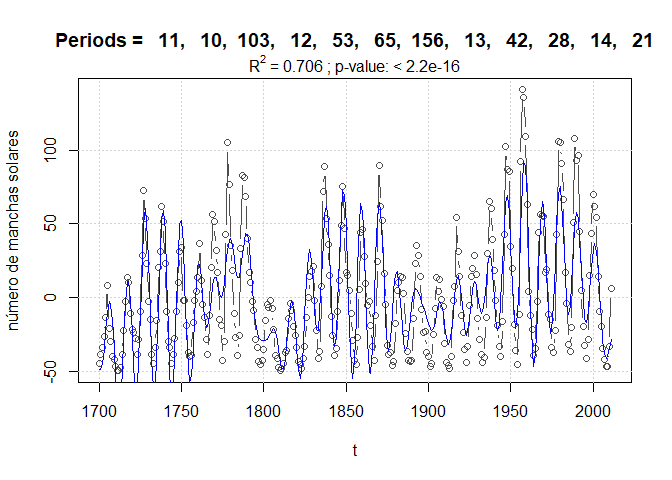

Extracción y modelación de periodicidades en series de tiempo regulares.
El paquete ‘periods’.
================

## Instalación

El paquete **periods** es la implementación en R del método presentado
en González-Rodríguez et al. (2015) (ver
<http://dx.doi.org/10.4236/ojs.2015.56062>). Se puede instalar desde
github con ayuda de **devtools**, el cual a su vez se instala de la
manera habitual en caso de no estar ya disponible.

``` r
install.packages("devtools") # si no está instalado

library(devtools)
install_github("hvillalo/periods") # instalación de 'periods' desde github
```

## Ejemplos de uso

### Serie simulada

El paquete incluye una serie de tiempo simulada (n = 220) con las
siguientes características: media = 0, sin tendencia lineal y cuatro
componentes armónicos definidos por los parámetros: periodos = 25, 10,
16, 73; amplitudes = 40, 20, 10, 5; y fases = 2, 5, 1, 0.
Adicionalmente, la serie contiene un 10 % de ruido aleatorio.

Una vez que el paquete ha sido activado, la serie simulada se puede
cargar en memoria con la función `data()`.

``` r
library(periods)

# Serie simulada
data(sim)

# gráfica 
plot(sim, type = "l")
```


**Búsqueda de periodicidades con descenso cíclico**

El primer paso del análisis consiste en buscar los periodos dominantes
en la serie de tiempo. De esto se encarga la función `cyclicDescent()`,
a la que le basta con que se especifique el vector de la serie de tiempo
a procesar.

``` r
sim.cd <- cyclicDescent(x = sim)
```

El resultado es una lista con los componentes armónicos encontrados y
las pruebas de significancia estadística del aumento de R<sup>2</sup>
entre modelos sucesivos.

``` r
# componentes armónicos
sim.cd$harmonics
```

              Period Amplitude      Phase       Lag      RSS      R.sq
    Model 1 :     25 40.290188  2.0200464  8.037509 76155.61 0.6998248
    Model 2 :     10 20.049342 -1.2151491 -1.933970 31938.24 0.8741121
    Model 3 :     16  9.856530  1.0029183  2.553910 21124.79 0.9167345
    Model 4 :     75  3.985973 -0.1135317 -1.355185 19415.50 0.9234718
    Model 5 :      5  2.170549  1.9933169  1.586231 18897.26 0.9255145

``` r
# estadísticos
sim.cd$Stats
```

                            F dfn dfd   p.value
    Models 1 & 2 : 148.829972   2 215 < 2.2e-16
    Models 2 & 3 :  54.515691   2 213 < 2.2e-16
    Models 3 & 4 :   9.287941   2 211 0.0001362
    Models 4 & 5 :   2.865822   2 209 0.0591766

Como puede verse, el aumento en R<sup>2</sup> al pasar del Modelo 4 (con
cuatro componentes armónicos) al Modelo 5, no es significativo, por lo
que este último se descarta.

La función `cyclicDescent()` tiene muchos argumentos más, cuyo uso se
puede consultar en la publicación mencionada o preferentemente en la
ayuda del paquete (`?cyclicDescent`), ya que **existen algunas
diferencias entre las implementaciones en Matlab y en R**.

Un ejemplo de un argumento interesante es `plots = TRUE`, el cual
produce los gráficos de cada modelo. Cabe mencionar que aparte del
primer modelo que solo tiene un componente armónico, los subsiguientes
corresponden a la suma de los componentes sucesivos. En el caso
anterior, por ejemplo, el modelo 3 incluye los periodos 25, 10, 16 y sus
correspondientes amplitudes y fases.

``` r
cyclicDescent(sim, plots = TRUE)
```


    $harmonics
              Period Amplitude      Phase       Lag      RSS      R.sq
    Model 1 :     25 40.290188  2.0200464  8.037509 76155.61 0.6998248
    Model 2 :     10 20.049342 -1.2151491 -1.933970 31938.24 0.8741121
    Model 3 :     16  9.856530  1.0029183  2.553910 21124.79 0.9167345
    Model 4 :     75  3.985973 -0.1135317 -1.355185 19415.50 0.9234718
    Model 5 :      5  2.170549  1.9933169  1.586231 18897.26 0.9255145

    $Stats
                            F dfn dfd   p.value
    Models 1 & 2 : 148.829972   2 215 < 2.2e-16
    Models 2 & 3 :  54.515691   2 213 < 2.2e-16
    Models 3 & 4 :   9.287941   2 211 0.0001362
    Models 4 & 5 :   2.865822   2 209 0.0591766

    attr(,"class")
    [1] "periods"

### Ajuste del modelo final por regresión lineal múltiple

Una vez encontrados los periodos significativos, se procede al ajuste
del modelo final, donde se hace la estimación de los parámetros $a_i$ y
$b_i$ de cada armónico, y en su caso de la tendencia lineal
($\alpha + \beta t$):

$$ X_e = \alpha + \beta t + \sum_{i=1}^m \bigg(a_i \cdot cos(2\pi p_i^{-1}t) + b_i \cdot sin(2\pi p_i^{-1}t) \bigg) $$

Este modelo corresponde a la llamada regresión periódica y se ajusta por
regresión lineal múltiple con la función `lm()`, que requiere que se le
pase la fórmula a ajustar de manera explícita, por ejemplo, para dos
armónicos y con tendencia lineal:

``` r
lm(x ~ t + cos(2*pi/25*t) + sin(2*pi/25*t) + cos(2*pi/10*t) + sin(2*pi/10*t))
```

Aunque la construcción de la fórmula del modelo no es difícil, la
función `periodicRegModel()` lo hace de manera automática y prepara
además los datos en un *data frame* para el ajuste. Esto puede incluir
generar el vector de tiempo si es que no se proporcionó o centrar la
serie de tiempo a media cero.

``` r
op <- sim.cd$harmonics$Period[1:4] # solo interesan los primeros 4 periodos
perReg <- periodicRegModel(x = sim, periods = op, center.x = FALSE)
# este es el modelo que será ajustado
perReg$model
```

    x ~ 0 + cos(2 * pi/25 * t) + sin(2 * pi/25 * t) + cos(2 * pi/10 * 
        t) + sin(2 * pi/10 * t) + cos(2 * pi/16 * t) + sin(2 * pi/16 * 
        t) + cos(2 * pi/75 * t) + sin(2 * pi/75 * t)
    <environment: 0x000001f937138538>

``` r
# ... y la tabla de datos
head(perReg$data) 
```

      t          x
    1 1 -6.8318049
    2 2  2.9818565
    3 3 -0.9092164
    4 4 35.0020263
    5 5 37.3203249
    6 6 40.2108500

Una vez preparado el modelo, el ajuste se haría con la función `lm()` de
la siguiente manera:

``` r
fit <- lm(perReg$model, data = perReg$data)
```

La salida de `lm()` es un objeto de la clase del mismo nombre que puede
aprovechar todas las funciones de R para modelos lineales, por ejemplo
calcular el Criterio de Información de Akaike (`AIC(fit)`), obtener las
gráficas diagnósticas (`plot(fit)`). Aquí ejemplificamos la obtención de
la tabla de la regresión:

``` r
summary(fit)
```


    Call:
    lm(formula = perReg$model, data = perReg$data)

    Residuals:
         Min       1Q   Median       3Q      Max 
    -20.9137  -6.0685   0.1568   6.8189  27.7316 

    Coefficients:
                       Estimate Std. Error t value Pr(>|t|)    
    cos(2 * pi/25 * t) -17.2271     0.9174 -18.778  < 2e-16 ***
    sin(2 * pi/25 * t)  36.5678     0.9084  40.257  < 2e-16 ***
    cos(2 * pi/10 * t)   7.0859     0.9123   7.767 3.40e-13 ***
    sin(2 * pi/10 * t) -19.1219     0.9127 -20.950  < 2e-16 ***
    cos(2 * pi/16 * t)   5.3803     0.9151   5.880 1.58e-08 ***
    sin(2 * pi/16 * t)   8.2687     0.9107   9.079  < 2e-16 ***
    cos(2 * pi/75 * t)   3.9101     0.9231   4.236 3.39e-05 ***
    sin(2 * pi/75 * t)  -0.4403     0.9028  -0.488    0.626    
    ---
    Signif. codes:  0 '***' 0.001 '**' 0.01 '*' 0.05 '.' 0.1 ' ' 1

    Residual standard error: 9.566 on 212 degrees of freedom
    Multiple R-squared:  0.9236,    Adjusted R-squared:  0.9208 
    F-statistic: 320.6 on 8 and 212 DF,  p-value: < 2.2e-16

La figura del modelo final se puede generar mediante la función
`plot_periodicReg()`:

``` r
plot_periodicReg(fit)
```


Por último, a partir de los coeficientes a<sub>i</sub> y b<sub>i</sub>
obtenidos con `lm()` podemos calcular las amplitudes y fases
correspondientes a través de la función `harmonics()`.

``` r
# generar armónicos
harmonics(fit)
```

    $cyclic_components
      Period Amplitude      Phase       Lag
    1     25 40.422479  2.0110591  8.001750
    2     10 20.392612 -1.2159209 -1.935198
    3     16  9.865049  0.9939467  2.531065
    4     75  3.934823 -0.1121260 -1.338406

### Manchas solares

Los datos de manchas solares por año usados en la publicación también se
incluyen en el paquete

``` r
data(sunspots)
```

#### Descenso cíclico

En este caso, es conveniente centrar la serie a media cero para
facilitar el ajuste. Para ello se utiliza el argumento
`center.x = TRUE`. Aunque este es su valor por defecto, lo incluimos
para no olvidarlo en los pasos siguientes. En el caso de la tendencia
lineal, su valor por defecto es `trend = FALSE`.

``` r
dc <- cyclicDescent(x = sunspots$number, t = sunspots$year, 
                    center.x = TRUE, trend = TRUE)
dc
```

    $harmonics
               Period Amplitude       Phase          Lag      RSS      R.sq
    Model 1 :      11 30.247311  0.34077196   0.59659096 343431.9 0.2935470
    Model 2 :      10 20.966748 -0.78665093  -1.25199383 275063.3 0.4341838
    Model 3 :     103 15.540306  0.41521134   6.80654259 237101.6 0.5122725
    Model 4 :      12 12.282051 -0.03944533  -0.07533504 213569.2 0.5606796
    Model 5 :      53 10.428548 -2.20983877 -18.64045848 196551.5 0.5956858
    Model 6 :      65  8.635190  2.80919476  29.06132009 185036.8 0.6193720
    Model 7 :      13  7.109731 -1.50883452  -3.12180015 177151.3 0.6355928
    Model 8 :      42  6.043541  3.12124861  20.86401006 171488.3 0.6472418
    Model 9 :     156  5.909010 -3.02416184 -75.08440775 166041.3 0.6584464
    Model 10 :     28  5.582236 -1.65101714  -7.35749108 161129.4 0.6685504
    Model 11 :     21  5.177679  1.06899579   3.57285525 156922.3 0.6772046
    Model 12 :     14  4.945557 -0.57673414  -1.28506126 153107.6 0.6850515
    Model 13 :      8  4.476783 -2.47294348  -3.14864943 149981.2 0.6914828

    $Stats
                             F dfn dfd   p.value
    Models 1 & 2 :   38.153290   2 307 1.590e-15
    Models 2 & 3 :   24.416353   2 305 1.459e-10
    Models 3 & 4 :   16.693228   2 303 1.326e-07
    Models 4 & 5 :   13.030520   2 301 3.738e-06
    Models 5 & 6 :    9.303282   2 299 0.0001203
    Models 6 & 7 :    6.610177   2 297 0.0015534
    Models 7 & 8 :    4.870839   2 295 0.0082947
    Models 8 & 9 :    4.805908   2 293 0.0088374
    Models 9 & 10 :   4.435461   2 291 0.0126614
    Models 10 & 11 :  3.874047   2 289 0.0218616
    Models 11 & 12 :  3.575293   2 287 0.0292616
    Models 12 & 13 :  2.970537   2 285 0.0528658

    attr(,"class")
    [1] "periods"

#### Regresión periódica

Al construir el modelo final, es importante hacerlo tal cual se hizo la
búsqueda de periodos en el descenso cíclico, es decir considerando si se
centró la serie y si se consideró tendencia.

``` r
p <- dc$harmonics$Period[1:12]
rp <- periodicRegModel(x = sunspots$number, t = sunspots$year, periods = p, 
                       center.x = TRUE, trend = TRUE)
```

Como puede verse, el modelo incluye ahora intercepto y coeficiente para
el vector de tiempo

``` r
rp$model
```

    x ~ t + cos(2 * pi/11 * t) + sin(2 * pi/11 * t) + cos(2 * pi/10 * 
        t) + sin(2 * pi/10 * t) + cos(2 * pi/103 * t) + sin(2 * pi/103 * 
        t) + cos(2 * pi/12 * t) + sin(2 * pi/12 * t) + cos(2 * pi/53 * 
        t) + sin(2 * pi/53 * t) + cos(2 * pi/65 * t) + sin(2 * pi/65 * 
        t) + cos(2 * pi/13 * t) + sin(2 * pi/13 * t) + cos(2 * pi/42 * 
        t) + sin(2 * pi/42 * t) + cos(2 * pi/156 * t) + sin(2 * pi/156 * 
        t) + cos(2 * pi/28 * t) + sin(2 * pi/28 * t) + cos(2 * pi/21 * 
        t) + sin(2 * pi/21 * t) + cos(2 * pi/14 * t) + sin(2 * pi/14 * 
        t)
    <environment: 0x000001f938162a18>

El ajuste con `lm()` y los componentes armónicos quedarían de la
siguiente manera

``` r
fit <- lm(rp$model, data = rp$data)
summary(fit)
```


    Call:
    lm(formula = rp$model, data = rp$data)

    Residuals:
       Min     1Q Median     3Q    Max 
    -52.91 -15.49  -0.64  14.49  73.22 

    Coefficients:
                          Estimate Std. Error t value Pr(>|t|)    
    (Intercept)         -117.46265   31.11575  -3.775 0.000195 ***
    t                      0.06310    0.01675   3.766 0.000201 ***
    cos(2 * pi/11 * t)    25.41778    1.85234  13.722  < 2e-16 ***
    sin(2 * pi/11 * t)     9.42312    1.85100   5.091 6.47e-07 ***
    cos(2 * pi/10 * t)    15.65667    1.83016   8.555 7.29e-16 ***
    sin(2 * pi/10 * t)   -15.26246    1.83783  -8.305 4.04e-15 ***
    cos(2 * pi/103 * t)   16.13681    1.86013   8.675 3.17e-16 ***
    sin(2 * pi/103 * t)    6.84133    1.93567   3.534 0.000477 ***
    cos(2 * pi/12 * t)    12.71049    1.84906   6.874 3.91e-11 ***
    sin(2 * pi/12 * t)    -0.39791    1.84906  -0.215 0.829769    
    cos(2 * pi/53 * t)    -7.19778    1.90993  -3.769 0.000199 ***
    sin(2 * pi/53 * t)    -8.55279    1.87478  -4.562 7.53e-06 ***
    cos(2 * pi/65 * t)    -9.44374    1.91117  -4.941 1.32e-06 ***
    sin(2 * pi/65 * t)     2.07071    1.86403   1.111 0.267553    
    cos(2 * pi/13 * t)     0.84981    1.85662   0.458 0.647500    
    sin(2 * pi/13 * t)    -6.60023    1.85243  -3.563 0.000429 ***
    cos(2 * pi/42 * t)    -6.26378    1.89940  -3.298 0.001098 ** 
    sin(2 * pi/42 * t)    -1.14878    1.91721  -0.599 0.549517    
    cos(2 * pi/156 * t)   -7.03273    1.91511  -3.672 0.000287 ***
    sin(2 * pi/156 * t)   -1.57338    1.95335  -0.805 0.421214    
    cos(2 * pi/28 * t)    -0.28962    1.85854  -0.156 0.876275    
    sin(2 * pi/28 * t)    -5.67616    1.83338  -3.096 0.002156 ** 
    cos(2 * pi/21 * t)     2.35251    1.83750   1.280 0.201484    
    sin(2 * pi/21 * t)     4.34345    1.84010   2.360 0.018924 *  
    cos(2 * pi/14 * t)     4.17030    1.84959   2.255 0.024907 *  
    sin(2 * pi/14 * t)    -2.71578    1.86363  -1.457 0.146144    
    ---
    Signif. codes:  0 '***' 0.001 '**' 0.01 '*' 0.05 '.' 0.1 ' ' 1

    Residual standard error: 22.82 on 286 degrees of freedom
    Multiple R-squared:  0.7063,    Adjusted R-squared:  0.6807 
    F-statistic: 27.52 on 25 and 286 DF,  p-value: < 2.2e-16

``` r
harmonics(fit)
```

    $linear_trend
            alpha         betha 
    -117.46265192    0.06309816 

    $cyclic_components
       Period Amplitude       Phase          Lag
    1      11 27.108280  0.35502153   0.62153775
    2      10 21.864901 -0.77264900  -1.22970908
    3     103 17.527136  0.40098792   6.57337863
    4      12 12.716718 -0.03129527  -0.05976957
    5      53 11.178469 -2.27037658 -19.15110774
    6      65  9.668091  2.92574045  30.26699361
    9     156  7.206577 -2.92149482 -72.53537340
    7      13  6.654710 -1.44274576  -2.98506156
    8      42  6.368254 -2.96020735 -19.78752858
    10     28  5.683542 -1.62177612  -7.22718321
    12     14  4.976636 -0.57723171  -1.28616993
    11     21  4.939621  1.07440787   3.59094380

#### Figura final

``` r
plot_periodicReg(fit, ylab = "número de manchas solares")
```



Como puede verse en el gráfico, los valores del número de manchas
solares tienen media cero debido al ajuste. Si no se hubiera usado
`trend = TRUE`, tampoco se mostraría el tiempo en años porque en la
matriz del modelo no estaría incluido el término para la tendencia
lineal. Sin embargo, la gráfica correcta se puede generar de manera muy
sencilla:

``` r
plot(sunspots, type = "b", col = "grey50", ylim = c(-20, 200))
lines(sunspots$year, fitted(fit) + mean(sunspots$number), col = "black", lwd = 2)
```


Mayores detalles del método se pueden consultar en González-Rodríguez et
al. (2015).

**Referencias**

<div id="refs" class="references csl-bib-body hanging-indent">

<div id="ref-GonzalezRodriguez2015" class="csl-entry">

González-Rodríguez, Eduardo, Héctor Villalobos, Víctor Manuel
Gómez-Muñoz, and Alejandro Ramos-Rodríguez. 2015. “Computational Method
for Extracting and Modeling Periodicities in Time Series.” *Open Journal
of Statistics* 05 (06): 604–17.
<https://doi.org/10.4236/ojs.2015.56062>.

</div>

</div>
